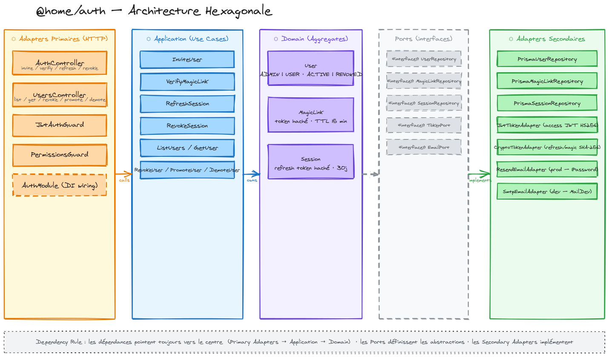

# Context Map

## Applications

| App                               | Description                                    |
| --------------------------------- | ---------------------------------------------- |
| [`apps/api`](apps/api/CONTEXT.md) | NestJS HTTP API — compose tous les modules BCs |

## Bounded Contexts

| Package                                  | Description                                     |
| ---------------------------------------- | ----------------------------------------------- |
| [`@home/auth`](packages/auth/CONTEXT.md) | Authentification magic link + autorisation RBAC |

## Packages outillage

| Package                                                    | Description                                                            |
| ---------------------------------------------------------- | ---------------------------------------------------------------------- |
| [`@home/config`](packages/config/CONTEXT.md)               | Configuration primitives — typed env parsing with Zod                  |
| [`@home/logger`](packages/logger/CONTEXT.md)               | Structured logging — `LoggerPort` + Pino adapter with OTel correlation |
| [`@home/telemetry`](packages/telemetry/CONTEXT.md)         | Distributed tracing — OpenTelemetry SDK → Grafana Cloud                |
| [`@home/posthog`](packages/posthog/CONTEXT.md)             | Shared PostHog client (internal, non publié)                           |
| [`@home/analytics`](packages/analytics/CONTEXT.md)         | Product analytics — `AnalyticsPort` → PostHog adapter                  |
| [`@home/feature-flags`](packages/feature-flags/CONTEXT.md) | Feature flags — `FeatureFlagsPort` → PostHog adapter                   |

## Graphe de dépendances

```
config ←── logger
config ←── telemetry
config ←── posthog ←── analytics
                   └── feature-flags
@opentelemetry/api ←── logger

auth ←── config
auth ←── logger

apps/api ←── auth
         ←── config
         ←── logger
         ←── telemetry
         ←── posthog
```

## Architecture

### @home/auth — Architecture Hexagonale



Les cinq couches de gauche à droite : **Adapters Primaires HTTP** (NestJS controllers + guards) → **Application** (use cases) → **Domain** (agrégats User / MagicLink / Session) → **Ports** (interfaces) → **Adapters Secondaires** (Prisma, JWT, Crypto, Resend, SMTP).

> Voir [`packages/auth/CONTEXT.md`](packages/auth/CONTEXT.md) pour le détail des workflows.

## Décisions système

Voir `docs/adr/` pour les ADRs couvrant l'ensemble du workspace.
