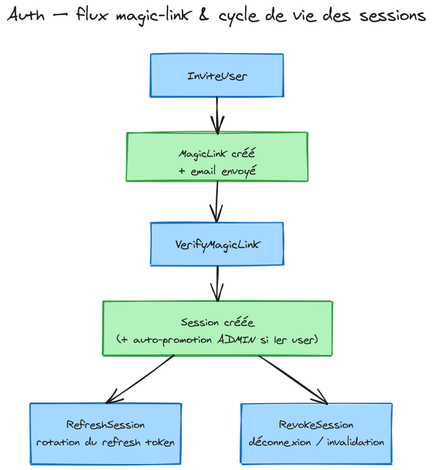

# BC Auth — Context

## Responsabilité

Authentification passwordless (magic link) et autorisation (RBAC) pour l'ensemble de l'application.

## Agrégats

| Agrégat     | Responsabilité                                               | Cycle de vie     |
| ----------- | ------------------------------------------------------------ | ---------------- |
| `User`      | Identité, rôle (`ADMIN`/`USER`), statut (`ACTIVE`/`REVOKED`) | Long (permanent) |
| `MagicLink` | Token d'invitation haché, TTL 15 min, single-use             | Court (éphémère) |
| `Session`   | Refresh token haché, TTL 30 jours, rotation single-use       | Moyen (30 jours) |

## Rôles et permissions

```
ADMIN → USERS_INVITE, USERS_REVOKE, USERS_PROMOTE, USERS_DEMOTE
USER  → (aucune permission admin)
```

Permissions définies comme enum statique dans le domaine — pas de table DB.

## Use cases

| Use case          | Accès                       | Description                                          |
| ----------------- | --------------------------- | ---------------------------------------------------- |
| `InviteUser`      | `USERS_INVITE` ou bootstrap | Crée MagicLink + envoie email                        |
| `VerifyMagicLink` | Public                      | Vérifie token, crée session, auto-promeut si premier |
| `RefreshSession`  | Public                      | Rotation refresh token → nouvelle paire JWT          |
| `RevokeSession`   | Authentifié                 | Invalide le refresh token (déconnexion)              |
| `RevokeUser`      | `USERS_REVOKE`              | Passe en REVOKED + invalide toutes ses sessions      |
| `PromoteUser`     | `USERS_PROMOTE`             | Élève un USER en ADMIN                               |
| `DemoteUser`      | `USERS_DEMOTE`              | Rétrograde un ADMIN en USER                          |
| `ListUsers`       | `ADMIN`                     | Liste paginée des utilisateurs                       |
| `GetUser`         | `ADMIN`                     | Détail d'un utilisateur                              |

## Événements domaine

| Événement     | Side-effect                                  |
| ------------- | -------------------------------------------- |
| `UserInvited` | Déclenche l'envoi de l'email via `EmailPort` |
| `UserRevoked` | Invalide toutes les sessions actives du user |

## Ports (interfaces)

| Port                  | Implémentation(s)                                                 |
| --------------------- | ----------------------------------------------------------------- |
| `UserRepository`      | `PrismaUserRepository`                                            |
| `MagicLinkRepository` | `PrismaMagicLinkRepository`                                       |
| `SessionRepository`   | `PrismaSessionRepository`                                         |
| `EmailPort`           | `ResendEmailAdapter` (prod), `SmtpEmailAdapter` (dev/MailDev)     |
| `TokenPort`           | `JwtTokenAdapter` (access) + `CryptoTokenAdapter` (refresh/magic) |

## Adapters HTTP (`src/adapters/http/`)

| Fichier            | Rôle                                                                                                      |
| ------------------ | --------------------------------------------------------------------------------------------------------- | ------- | ------- |
| `AuthModule`       | Module NestJS — câble tous les providers via string tokens DI                                             |
| `AuthController`   | Routes publiques : `POST /auth/invite`, `POST /auth/verify`, `POST /auth/refresh`, `DELETE /auth/session` |
| `UsersController`  | Routes admin (Bearer + RBAC) : `GET /users`, `GET /users/:id`, `POST /users/:id/revoke                    | promote | demote` |
| `JwtAuthGuard`     | Guard Bearer — vérifie le JWT via `TokenPort.verifyAccessToken`, attache `request.user`                   |
| `PermissionsGuard` | Guard RBAC — lit `@RequirePermission` metadata via `Reflector`, vérifie `user.hasPermission()`            |

### DI tokens

Tous les providers NestJS utilisent des **string tokens** (`'UserRepository'`, `'TokenPort'`, etc.) pour rester découplés des implémentations concrètes. Les adaptateurs in-memory sont injectés par défaut ; les adaptateurs prod (Prisma, Resend, JWT) peuvent surcharger via `overrideProvider` en tests ou via un module de production distinct.

### Swagger

L'API est documentée via `@nestjs/swagger`. L'UI est accessible à `/docs` en dev. `@ApiTags`, `@ApiOperation`, `@ApiBearerAuth` sont posés sur les deux controllers.

## Infrastructure

- **DB** : SQLite via Prisma (`prisma/schema.prisma`)
- **Migrations** : `prisma migrate deploy` au démarrage
- **Tests d'intégration** : SQLite in-memory (`file::memory:`)
- **Email prod** : Resend (API key via 1Password)
- **Email dev** : MailDev via SMTP

## Tests

| Type                         | Localisation                                   | Stratégie                                                      |
| ---------------------------- | ---------------------------------------------- | -------------------------------------------------------------- |
| Use cases (application core) | `src/application/**/__tests__/`                | Sociable — in-memory adapters, domaine réel                    |
| Repositories (intégration)   | `src/adapters/prisma/__tests__/`               | SQLite in-memory réelle                                        |
| E2E HTTP                     | `src/adapters/http/__tests__/auth.e2e.spec.ts` | `@nestjs/testing` + Fastify `app.inject()`, adapters in-memory |

## Règles domaine clés

1. **Bootstrap** : si aucun `User` en DB, `InviteUser` est accessible sans auth
2. **Auto-promotion** : si aucun `ADMIN` au moment de `VerifyMagicLink` → promu `ADMIN`
3. **Magic link single-use** : le token est invalidé immédiatement après vérification
4. **Refresh token rotation** : chaque usage génère un nouveau token, l'ancien est invalidé
5. **Révocation totale** : `RevokeUser` invalide toutes les sessions actives

## Dépendances

```
@home/auth
  ├── @home/config   (configuration Zod)
  ├── @home/logger   (LoggerPort)
  └── prisma         (client généré dans packages/auth)
```

## Diagrammes

### Architecture hexagonale


Le diagramme se lit de gauche à droite, suivant la **Dependency Rule** :

| Zone                 | Couleur           | Contenu                                                                                         | Rôle                                               |
| -------------------- | ----------------- | ----------------------------------------------------------------------------------------------- | -------------------------------------------------- |
| Adapters Primaires   | Orange            | `AuthController`, `UsersController`, `JwtAuthGuard`, `PermissionsGuard`, `AuthModule`           | Reçoivent les appels HTTP, délèguent aux use cases |
| Application          | Bleu              | 9 use cases (`InviteUser` … `DemoteUser`)                                                       | Orchestrent le domaine via les ports               |
| Domain               | Violet            | `User`, `MagicLink`, `Session`                                                                  | Logique métier pure, zéro dépendance externe       |
| Ports                | Gris (pointillés) | `UserRepository`, `MagicLinkRepository`, `SessionRepository`, `TokenPort`, `EmailPort`          | Interfaces définies par le domaine/application     |
| Adapters Secondaires | Vert              | Prisma repos, `JwtTokenAdapter`, `CryptoTokenAdapter`, `ResendEmailAdapter`, `SmtpEmailAdapter` | Implémentent les ports (infrastructure)            |

Les dépendances ne vont **jamais** vers la droite — le domaine ignore l'infrastructure.

> Source : [`docs/diagrams/auth-hexagonal-architecture.excalidraw`](../../docs/diagrams/auth-hexagonal-architecture.excalidraw)

---

### Flux magic-link & cycle de vie des sessions



Quatre workflows couverts :

**1. Invitation (`InviteUser`)**
Un admin (ou bootstrap) appelle `POST /auth/invite` → `InviteUser` crée un `MagicLink` (token SHA-256, TTL 15 min) et déclenche `UserInvited` → `EmailPort.sendMagicLink` envoie le lien à l'utilisateur.

**2. Vérification (`VerifyMagicLink`)**
L'utilisateur clique le lien → `POST /auth/verify` → `VerifyMagicLink` vérifie le token haché, invalide le `MagicLink` (single-use), crée une `Session` → retourne `{ accessToken (JWT 15 min), refreshToken (opaque 30 j) }`. Si aucun `ADMIN` existant → auto-promotion.

**3. Renouvellement (`RefreshSession`)**
`POST /auth/refresh` avec `refreshToken` → `RefreshSession` invalide l'ancien token, génère une nouvelle paire → rotation garantit qu'un token volé est détecté au prochain usage.

**4. Déconnexion (`RevokeSession`)**
`DELETE /auth/session` (Bearer requis) avec `refreshToken` → `RevokeSession` invalide la session → l'access token expire naturellement (15 min).

> Source : [`docs/sessions/diagrams/auth-flow.excalidraw`](../../docs/sessions/diagrams/auth-flow.excalidraw)

## ADRs associés

- [ADR-0008](../../docs/adr/ADR-0008-auth-bc-sqlite-prisma.md) — SQLite via Prisma
- [ADR-0009](../../docs/adr/ADR-0009-auth-jwt-access-refresh.md) — JWT access + refresh
- [ADR-0010](../../docs/adr/ADR-0010-auth-magic-link-invite-only.md) — Magic link invite-only
- [ADR-0011](../../docs/adr/ADR-0011-auth-rbac-static-permissions.md) — RBAC statique
- [ADR-0012](../../docs/adr/ADR-0012-nestjs-single-app.md) — NestJS single app
